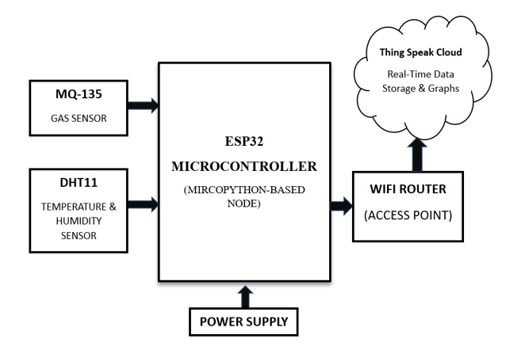
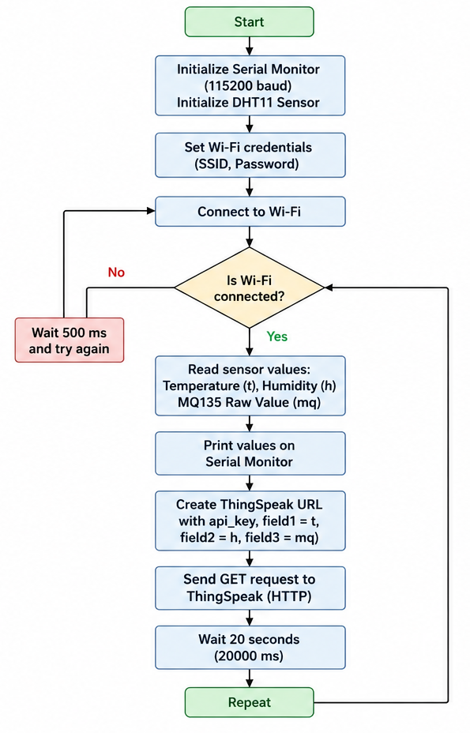
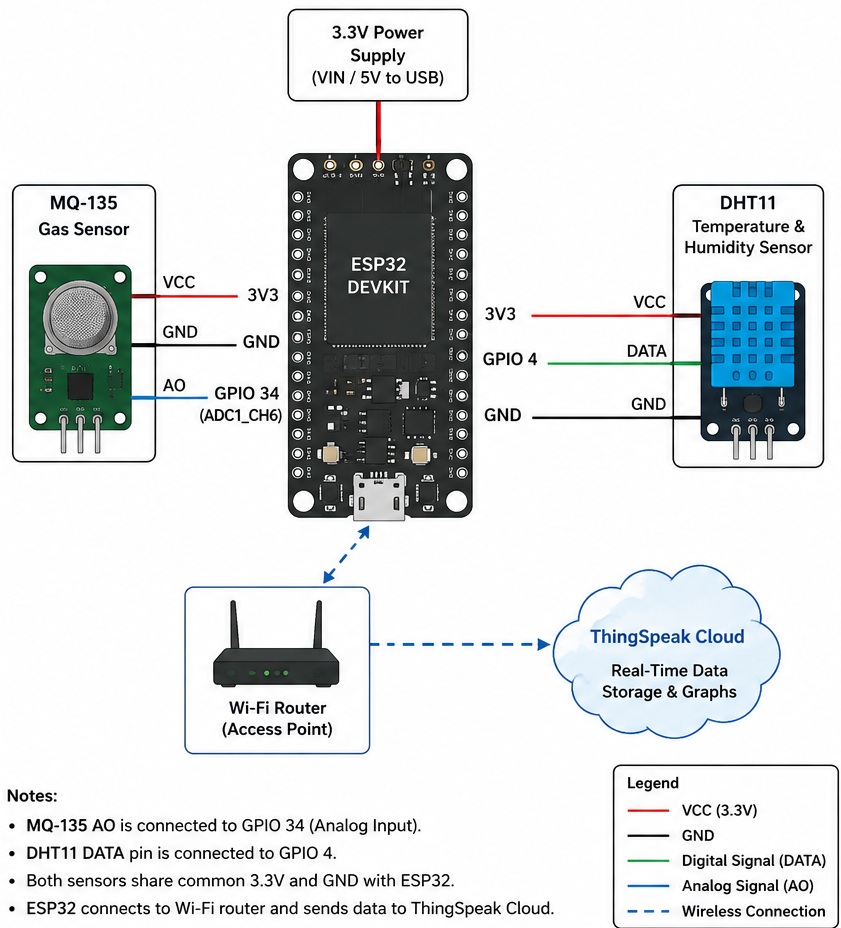
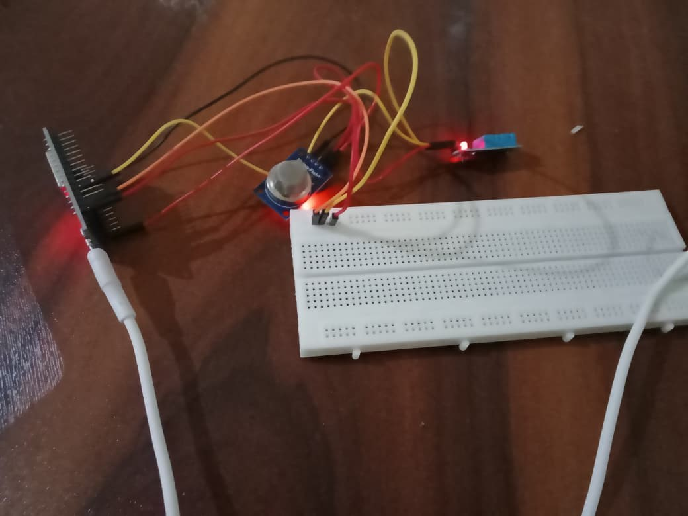
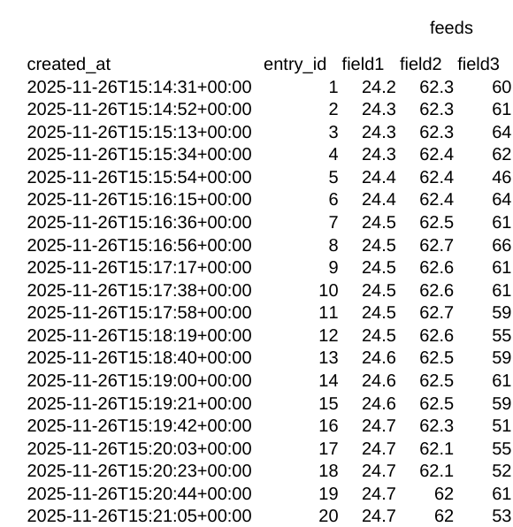
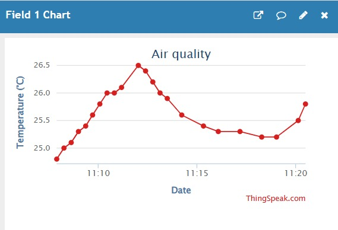
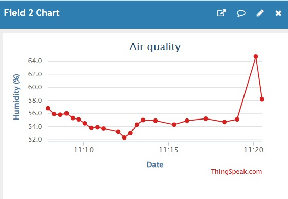
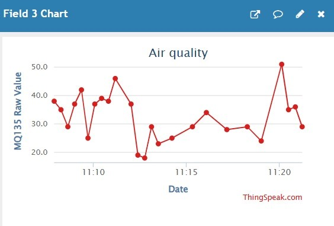

# Environmental Monitoring Network

An IoT-based environmental monitoring system that collects temperature, humidity, and gas sensor data using an ESP32 and uploads the readings to the ThingSpeak cloud platform for remote monitoring and visualization.

## Overview

This project implements a basic environmental monitoring system using embedded sensors and cloud connectivity.

The ESP32 collects data from:

- **DHT11** for temperature and humidity
- **MQ135** for gas sensor readings

The collected data is transmitted over Wi-Fi to ThingSpeak, where the readings can be stored and visualized through charts.

## Features

- Real-time temperature monitoring
- Humidity monitoring
- MQ135 analog sensor monitoring
- ESP32-based data acquisition
- Wi-Fi connectivity
- Cloud data logging using ThingSpeak
- Periodic sensor updates every 20 seconds
- Serial Monitor output for debugging

## Hardware Components

| Component | Purpose |
|---|---|
| ESP32 | Main microcontroller and Wi-Fi connectivity |
| DHT11 | Temperature and humidity sensing |
| MQ135 | Analog gas sensor readings |
| Breadboard | Hardware prototyping |
| Jumper wires | Circuit connections |
| Wi-Fi | Cloud connectivity |
| ThingSpeak | Cloud-based data storage and visualization |

## System Architecture

The system follows the data flow below:

**DHT11 + MQ135 → ESP32 → Wi-Fi → ThingSpeak Cloud**

## Working Principle

1. The ESP32 initializes the Serial Monitor and DHT11 sensor.
2. The ESP32 connects to the configured Wi-Fi network.
3. Temperature and humidity values are read from the DHT11 sensor.
4. The analog value from the MQ135 sensor is read through GPIO 34.
5. The sensor readings are displayed on the Serial Monitor.
6. The ESP32 creates a ThingSpeak update request.
7. Temperature, humidity, and MQ135 readings are sent to ThingSpeak.
8. The system waits for 20 seconds.
9. The process repeats continuously.

## Pin Configuration

| Sensor | ESP32 Connection |
|---|---|
| DHT11 Data | GPIO 4 |
| MQ135 Analog Output | GPIO 34 |

## System Flow

## Circuit Diagram

## Software

The firmware is written for the ESP32 using the Arduino framework.

The program:

- Connects the ESP32 to Wi-Fi
- Reads temperature and humidity using the DHT11 sensor
- Reads the analog output from the MQ135 sensor
- Sends the collected data to ThingSpeak using HTTP
- Updates the cloud platform every 20 seconds

The source code is available in the `code` folder.

> **Note:** Wi-Fi credentials and the ThingSpeak API key should not be exposed in a public repository. Use placeholders before uploading the code.

## Hardware Implementation

The project was physically implemented using an ESP32, DHT11 sensor, MQ135 sensor, breadboard, and jumper wires.

## Cloud Monitoring Results

Sensor readings were successfully transmitted to ThingSpeak and stored as timestamped data entries.

### ThingSpeak Data Feed

### Temperature Readings

### Humidity Readings

### MQ135 Sensor Readings

## Results

The project successfully demonstrated an end-to-end IoT environmental monitoring workflow:

**Sensors → ESP32 → Wi-Fi → ThingSpeak Cloud**

The ESP32 successfully collected:

- Temperature data from the DHT11 sensor
- Humidity data from the DHT11 sensor
- Analog gas sensor readings from the MQ135

The collected sensor data was transmitted over Wi-Fi and uploaded to the ThingSpeak cloud platform, where it was stored as timestamped entries and visualized using charts.

The physical hardware setup and ThingSpeak results demonstrate the complete implementation of the system, from sensor data acquisition to cloud-based monitoring.

## Future Improvements

Possible future enhancements include:

- Integration of additional environmental sensors
- Calibration of the MQ135 sensor for more meaningful air-quality measurements
- Local display for real-time sensor readings
- Threshold-based alerts and notifications
- Mobile or web dashboard integration
- Long-term environmental data analysis

## Conclusion

This project demonstrates a basic IoT-based environmental monitoring system using an ESP32, DHT11 sensor, MQ135 sensor, Wi-Fi connectivity, and the ThingSpeak cloud platform.

The system successfully collects environmental sensor data and transmits it to the cloud for remote storage and visualization. The project demonstrates the complete workflow of an IoT monitoring system, including sensor interfacing, microcontroller-based data acquisition, wireless communication, and cloud-based data monitoring.
